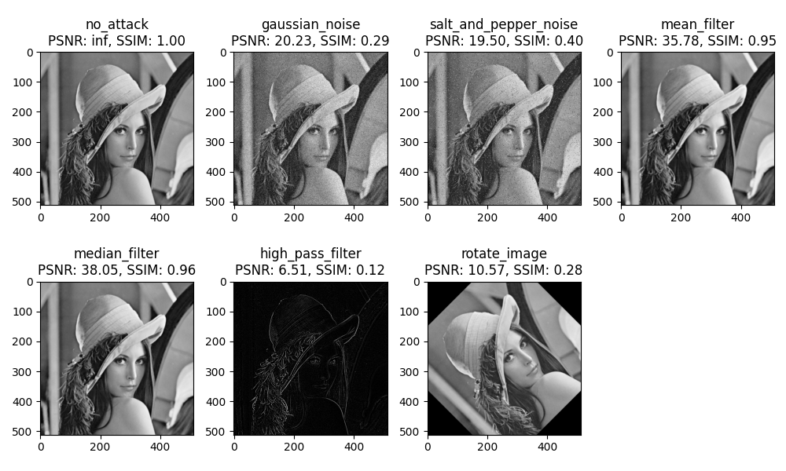

# Multimedia_Security_Final_Project
## LSB
使用最低有效位（LSB）在數字數據的二進制表示中嵌入額外的信息，這樣的技術可以用來隱藏訊息，而不引起人眼或人耳的感知變化。 
直接跑main.py即可

請選擇功能： 
1.隱寫 
將watermark的高三位信息替換掉background的低三位信息 
  
  
2.攻擊 
attacks = ['no_attack', 'gaussian_noise', 'salt_and_pepper_noise', 'mean_filter', 'median_filter', 'high_pass_filter', 'rotate_image'] 
利用以上攻擊方法，攻擊"image\Marked.jpg"， 
並產生統計圖("result\Marked_Attack\all_results.jpg")及數據("result\Marked_Attack\attack_results.txt")及攻擊後的個別圖片("image\Attack_result\\{attacks_name}.jpg") 
<!-->-->
 
嵌入的圖Marked.jpg與攻擊後的個別圖片Attack_result\\{attacks_name}.jpg做PSNR計算
Attack Results for LSB 

Attack Type: no_attack 
PSNR: inf, SSIM: 1.0  

Attack Type: gaussian_noise 
PSNR: 20.23981785210106, SSIM: 0.28832284946794356  

Attack Type: salt_and_pepper_noise 
PSNR: 19.390703024359855, SSIM: 0.3873352626308505  

Attack Type: mean_filter 
PSNR: 35.64094299879962, SSIM: 0.9485151200508769  

Attack Type: median_filter 
PSNR: 37.77993611415274, SSIM: 0.9569102603020584  

Attack Type: high_pass_filter 
PSNR: 6.456283796642342, SSIM: 0.11993592433976924  

Attack Type: rotate_image 
PSNR: 10.574410910655256, SSIM: 0.2803647614167634  

3.提取 
從被攻擊的圖中取出浮水印，並對其計算SSIM。("result\Attack_Extract\ssim.txt") 
原浮水印watermark.jpg與攻擊後取出的圖Extract_watermark\\{attacks_name}.jpg做SSIM計算
Extract Results for LSB 

Attack Type: no_attack 
SSIM: 0.015352597439659377  

Attack Type: gaussian_noise 
SSIM: 0.008494161093138454  

Attack Type: salt_and_pepper_noise 
SSIM: 0.0071360329227082705  

Attack Type: mean_filter 
SSIM: 0.006409435783714635  

Attack Type: median_filter 
SSIM: 0.011256819544516978  

Attack Type: high_pass_filter 
SSIM: 0.010998056046992786  

Attack Type: rotate_image 
SSIM: 0.0039900751036624086  

4.退出 
結束應用 

## Shift-Histogram
使用直方圖的位移中嵌入額外的信息，這樣的技術可以用來隱藏訊息，而不引起人眼或人耳的感知變化。 
直接跑Reversible_Data_Hiding.py即可

請選擇功能： 
1.隱寫 
使用Key(random)加密明文("image\lena.bmp")，生成密文("image\Marked_Image.png") 
<!---->
 

2.攻擊 
attacks = ['no_attack', 'gaussian_noise', 'salt_and_pepper_noise', 'mean_filter', 'median_filter', 'high_pass_filter', 'rotate_image'] 
利用以上攻擊方法，攻擊"image\Marked.png"， 
並產生統計圖("result\Marked_Attack\all_attack_results.png")及數據("result\Marked_Attack\attack_results.txt")及攻擊後的個別圖片("image\Attack_result\\{attacks_name}.jpg") 
<!---->
 
嵌入的圖Marked.png與攻擊後的個別圖片Attack_result\\{attacks_name}.jpg做PSNR計算
Attack Results for Shift-Histogram 

Attack Type: no_attack 
PSNR: inf, SSIM: 1.0  

Attack Type: gaussian_noise 
PSNR: 20.23271008722442, SSIM: 0.28798474104589006  

Attack Type: salt_and_pepper_noise 
PSNR: 19.4982824314409, SSIM: 0.39654733966451616  

Attack Type: mean_filter 
PSNR: 35.782896570076595, SSIM: 0.9513022495580442  

Attack Type: median_filter 
PSNR: 38.04640983929006, SSIM: 0.9597879802025877  

Attack Type: high_pass_filter 
PSNR: 6.513695576797679, SSIM: 0.11993722177372275  

Attack Type: rotate_image 
PSNR: 10.57415453970766, SSIM: 0.28074561350306537  

3.提取 
從被攻擊的圖中取出浮水印，並對其計算BER。("result\Attack_Extract\ber.txt") 
<!---->

Extract Results for Shift-Histogram 

Attack Type: no_attack 
BER: 0.9955863952636719  

Attack Type: gaussian_noise 
BER: 0.9960060119628906  

Attack Type: salt_and_pepper_noise 
BER: 0.9961700439453125  

Attack Type: mean_filter 
BER: 0.9956550598144531  

Attack Type: median_filter 
BER: 0.995452880859375  

Attack Type: high_pass_filter 
BER: 0.9996681213378906  

Attack Type: rotate_image 
BER: 0.9961471557617188  

4.退出 
結束應用 

